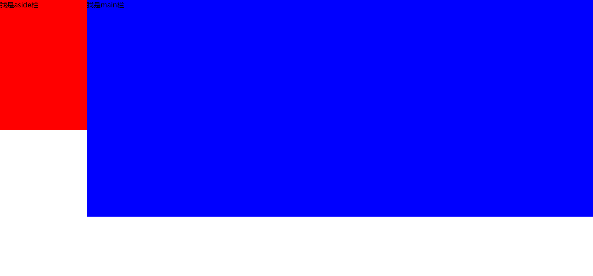
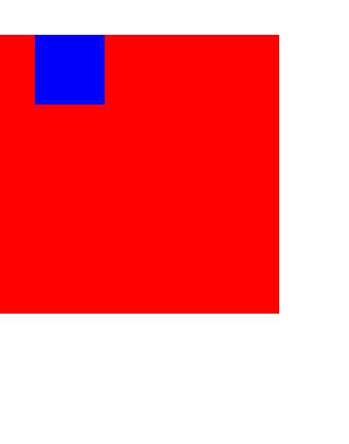
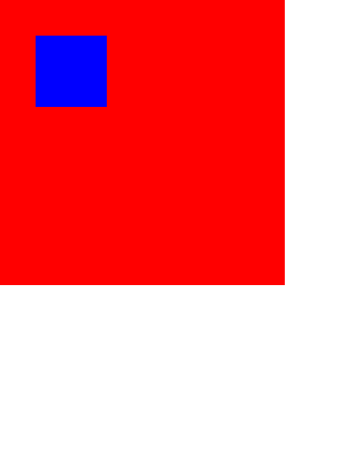

# BFC（Block formatting contexts）——块级格式化上下文

>第一次接触到BFC时，其实是一脸懵逼，不知道它是什么，也不知道它怎么用。了解一番之后，发现我们在平时写页面布局时经常会用到它来解决一些问题。只是我们不知道那就是BFC。因此在理解BFC时，我们最好能结合它的用途来看，这样就很容易理解。下面是我在阅读一些资料后，将我对BFC的理解总结如下。

### 1、BFC是什么？

BFC就是页面中一个独立的渲染容器，容器内部的子元素不会影响到容器外的元素，容器外的元素也同样不会影响到容器内部的子元素。

### 2、产生BFC的条件有哪些（触发元素形成BFC的条件）？

* 根元素

* 浮动元素（float值不为none）

* 绝对定位元素（元素的position为absolute或fixed）

* display为inline-block、table-cell、table-caption、flex的元素

* overflow值不为visible的元素

### 3、BFC的应用

（1）自适应两栏布局

可以利用浮动和BFC来实现两栏布局，让其中一个元素浮动，浮动使该元素脱离标准文档流，此时，如果不给另一个元素设置BFC，那么第二个元素会占据浮动元素的位置，两个元素产生重叠，这是因为他们都处在body根元素的BFC中，因此，两个元素的左边要与body的左边接触。如图：

`代码见“自适应两栏布局（1）.html”`

如果给第二个元素设置BFC，那么两个元素就不会重叠，这是因为BFC是独立容器，不会与容器外的浮动元素产生任何影响，此时就形成了一个自适应的两栏布局。如图：

`代码见“自适应两栏布局（2）.html”`

（2）清除内部浮动

为子元素设置浮动后，浮动元素会脱离标准文档流，导致父元素高度塌陷。如图：

`代码见“清除内不浮动（1）.html”`

解决方法：

为了防止父元素高度塌陷，可以触发父元素产生BFC。因为`在计算BFC时，浮动元素也参与计算`。如图：

`代码见“清除内不浮动（2）.html”`

（3）防止子元素的margin产生“留白”现象

父元素中含有一个子元素，为该子元素设置margin值，该元素产生的margin会超出父元素的区域，从而产生一种“留白”现象。如图：

`代码见“防止子元素的margin产生留白现象（1）.html”`

解决方法：

触发父元素产生BFC，这样子元素的margin就会限制在父元素的区域内，不会产生“留白”现象。如图：

`代码见“防止子元素的margin产生留白现象（2）.html`

（4）防止垂直margin重叠

在同一个BFC区域内，两个相邻的块级元素的margin在垂直方向上会出现重叠。如图：

`代码见“防止垂直margin重叠（1）.html”`

解决方法：

为其中一个元素添加一个父元素，并触发该父元素产生BFC，这样就可以解决垂直margin重叠。如图：

`代码见防止垂直margin重叠（2）.html`

### 4、总结

* 在BFC内部，块级元素会在垂直方向上一个接一个的排列

* 在BFC内部，块级元素在垂直方向上的间距由块级元素的margin值决定。属于同一个BFC的
两个相邻的块级元素，其margin会在垂直方向上产生重叠；

* 在BFC内部，块级元素的左边（如果块级元素存在margin，那么块级元素的margin与BFC的左边相接触；如果没有margin，有border，那么块级元素元素的border与BFC的左边相接触）与BFC的左边相接处，浮动元素也是如此。

* BFC的区域不会与外部float元素区域重叠

* BFC就是页面中的一个独立的渲染容器，容器内部的子元素不会影响到外面的元素，反之亦然

* 在计算BFC区域的高度时，内部的浮动元素也参与计算

### 5、参考文献

(1) [深入理解BFC和Margin Collapse](https://www.w3cplus.com/css/understanding-bfc-and-margin-collapse.html)

(2) [块格式化上下文](https://developer.mozilla.org/zh-CN/docs/Web/Guide/CSS/Block_formatting_context)

(3) [理解CSS中BFC](https://www.w3cplus.com/css/understanding-block-formatting-contexts-in-css.html)
