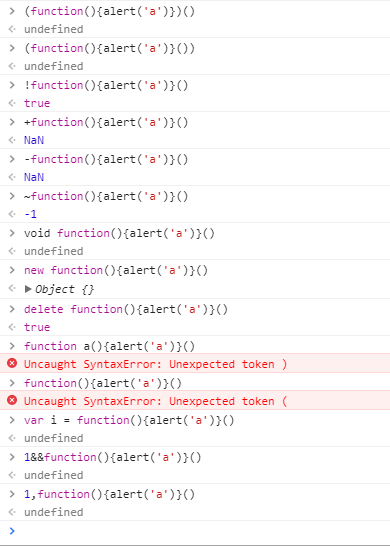

# 函数的自执行

今天看到一段代码，就长下面这样：
```
!function(){
    ......
}();
```
看完之后不是很懂这样形式的代码是啥意思，但是可以猜出它应该是将函数自执行的一种写法。确实，后来查了一下它的写成这样就是让函数自执行。那么除了这种样式的写法，还有啥样子的写法呢？于是就通过查资料进行了以下总结：

### 函数自执行写法：

>加括号

```
(function(){alert('a')})()    返回值//undefined

(function(){alert('a')}())          //undefined
```

>加运算符

```
!function(){alert('a')}()           //true

+function(){alert('a')}()           //NaN

-function(){alert('a')}()           //NaN

~function(){alert('a')}()           //-1
```

>加关键字

```
void function(){alert('a')}()       //undefined

new function(){alert('a')}()        //Object{}

delete function(){alert('a')}()     //true
```

>其他

```
var i = function(){alert('a')}()    //undefined

1&&function(){alert('a')}()         //undefined

1,function(){alert('a')}()          //undefined
```

上述写法都可以实现函数的自执行，无论是给函数加括号还是感叹号还是运算符还是关键字还是其他，这么做的目的是 **让函数声明变为函数表达式** ，然后通过加`()`直接调用。

以上方法中关键字new的方法是最慢的，`(function(){;})()`比较快，加号在Chrome中速度最快。

上面代码在Chrome浏览器console上运行的结果如图所示：


### 补充：

```
function a(){alert('a')}            //undefined
```

一般函数没有返回值，所以返回值为`undefined`，

```
function a(){alert('a')}()          //SyntaxError

function(){alert('a')}()            //SyntaxError
```

上面两种写法并不能实现函数自执行，这是因为它将函数声明与函数调用相混淆了。

### 参考文献：
[function与感叹号](https://swordair.com/function-and-exclamation-mark/)